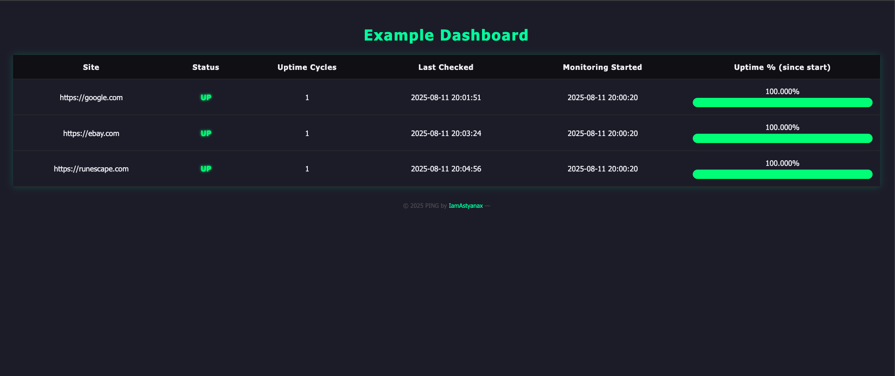

# PING - Easily monitor a website or endpoint

PHP Incident Notification Gateway - PING

PING is the stupid simple "Is it up?" application. PING sends emails via PHP to alert if a site is down by either ping or web status. 

PING can be easily configured for different intervals of monitoring such as how often to check if a website is up and the total number of intervals of failure before alerting. 

It is written in easy to read PHP and highly portable in a container.

# How to run
You must have docker and docker-compose installed.

## To build the image:
`docker build -t ping .`

## Variables in Docker-Compose
EMAIL_USER=YOUR_EMAIL_USER = Email account to use for SMTP
EMAIL_PASS=YOUR_EMAIL_PASSWORD = Email password to use for SMTP
ALERT_EMAIL=EMAIL_TO_ALERT_OR_TEAMS = Email to send alerts to
CHECK_INTERVAL=SECONDS_TO_CHECK_ENDPOINT = How often you want to check status of sites
MAX_ATTEMPTS=NUMBER_OF_ATTEMPTS_BETWEEN_INTERVALS = Number of attempts to make to a site before determined failure.
SMTP_HOST=MAIL_SERVER = Your Mail Server
SMTP_AUTH=true
SMTP_SECURE=tls
SMTP_PORT=587
COMPANY_NAME=YOUR_COMPANY_NAME

Set your target sites here:
SITES_JSON=[
{"target":"example01.com","monitorType":"WEB"},
{"target":"example02.com","monitorType":"WEB"},
{"target":"example03.com","monitorType":"PING"},
           ]

Please note `monitorType`. Setting to `WEB` will look up HTTP status. `PING` will use ICMP.

`docker compose up -d`

The container will start and run on port 80 and will forward to port 8000 to the apache web server.

## Dashboard
The dashboard will present a nice interface to see uptime status, status, etc. You can monitor multiple sites and decide how often to check their status.
Every 10 seconds the dashboard will refresh.

